# MIRS System Flowchart

This diagram summarizes the current Laravel/Inertia/Vue web app from the checked-out codebase. It focuses on the whole-system request path, module surfaces, shared services, and database record groups rather than every individual CRUD route.

```mermaid
flowchart TD
    Browser["Users<br/>desktop browser, tablet, PWA"] --> Entry["/ redirects to login"]
    Browser --> Web["Laravel web routes<br/>routes/web.php + routes/auth.php"]
    Browser --> Api["Laravel API routes<br/>routes/api.php"]

    Entry --> AuthPages["Guest auth pages<br/>login, forgot password"]
    AuthPages --> LoginController["Auth controllers<br/>session, password, confirmation"]
    LoginController --> Session["Session + CSRF cookies"]

    Web --> GlobalMiddleware["Global + web middleware<br/>HTTPS from APP_URL, CORS, no-index,<br/>session, CSRF, active account, Inertia"]
    Api --> ApiMiddleware["API middleware<br/>Sanctum, active account,<br/>password changed, throttle"]

    Session --> Protected["Protected app area<br/>auth + password.changed"]
    GlobalMiddleware --> Protected
    Protected --> SharedProps["Inertia shared props<br/>auth user, role/position permissions,<br/>feature flags, Ziggy routes, CSRF token"]
    SharedProps --> AppShell["Vue AppLayout<br/>sidebar, mobile nav,<br/>approval notification menu, PWA banners"]
    AppShell --> Dashboard["Dashboard<br/>module stats, recent activity,<br/>pending approval summary"]

    Dashboard --> ModuleChoice{"User selects module"}
    AppShell --> ModuleChoice

    ModuleChoice --> Annealing["Annealing Checks<br/>index, create, show, edit,<br/>import preview/execute, export,<br/>approval"]
    ModuleChoice --> Temperature["Temperature Records<br/>index, create, show, edit,<br/>import preview/execute,<br/>approval"]
    ModuleChoice --> Torque["Torque Records<br/>index, create, show, edit,<br/>import preview/execute, export,<br/>approval"]
    ModuleChoice --> Magnetism["Magnetism Checksheet<br/>checksheets, batches, checkpoints,<br/>import preview/execute, export route"]
    ModuleChoice --> Welding["Welding Checksheets<br/>index, create, duplicate, show, edit,<br/>next letter code, import preview/execute,<br/>export, approval"]
    ModuleChoice --> Material["Material Monitoring<br/>index, create, show, edit"]
    ModuleChoice --> Modification["Modification Logs<br/>index, create, show, edit"]
    ModuleChoice --> UserAdmin["User Management<br/>users, scanner, scan-create,<br/>badge print, QR regenerate, bulk actions"]
    ModuleChoice --> SystemAdmin["Super Admin Settings<br/>departments, positions, roles,<br/>permission sync, status toggles"]
    ModuleChoice --> ActivityAdmin["Activity Logs<br/>filter, show, delete, bulk delete"]
    ModuleChoice --> Profile["Profile<br/>update profile, password, delete"]
    ModuleChoice --> PendingApprovals["Pending Approvals hub<br/>module summaries and record links"]

    Annealing --> PermissionGate["module.permission middleware<br/>view, create, update, delete,<br/>import, export, approve"]
    Temperature --> PermissionGate
    Torque --> PermissionGate
    Magnetism --> PermissionGate
    Welding --> PermissionGate
    Material --> PermissionGate
    Modification --> PermissionGate

    UserAdmin --> RoleGate["role middleware<br/>admin/super_admin"]
    ActivityAdmin --> RoleGate
    SystemAdmin --> SuperAdminGate["role middleware<br/>super_admin"]

    PermissionGate --> FormRequests["Validation layer<br/>FormRequests + upload rules"]
    RoleGate --> FormRequests
    SuperAdminGate --> FormRequests

    FormRequests --> Controllers["Module controllers<br/>CRUD, filters, imports, exports,<br/>approval actions, duplicate flows"]
    Controllers --> Services["Shared services"]

    Services --> DashboardService["DashboardReportingService<br/>visible modules + aggregated counts"]
    Services --> ApprovalService["ApprovalWorkflowService<br/>initial status + pending module summaries"]
    Services --> NotificationService["ApprovalNotificationService<br/>approver lookup, actionable notifications,<br/>mark acted, broadcast updates"]
    Services --> ActivityService["ActivityService<br/>create/update/delete/login/import/export/<br/>approve/reject audit trail"]
    Services --> DuplicateGuard["DuplicateRecordGuard<br/>cache lock + transaction duplicate check"]
    Services --> ImportSecurity["SpreadsheetImportSecurity<br/>safe temp storage, path validation,<br/>failure references"]
    Services --> QrService["QrCodeService<br/>employee QR/badge data"]

    Annealing -. "Excel file" .-> ImportSecurity
    Temperature -. "Excel file" .-> ImportSecurity
    Torque -. "Excel file" .-> ImportSecurity
    Magnetism -. "Excel file" .-> ImportSecurity
    Welding -. "Excel file" .-> ImportSecurity

    ImportSecurity --> Importers["Import classes<br/>PhpSpreadsheet parsing + preview/execute"]
    Importers --> Controllers

    Controllers --> Exports["Excel exports<br/>Maatwebsite Excel where implemented"]
    Exports --> Browser

    ApprovalService --> ApprovalRecords["Approval status fields<br/>pending, approved, rejected"]
    NotificationService --> ApprovalNotifications["approval_notifications"]
    NotificationService --> Broadcast["ApprovalNotificationsChanged event<br/>Laravel Echo / Pusher when configured"]
    NotificationService --> Mail["Email notification<br/>Annealing approvers when mail works"]
    Broadcast --> AppShell
    Mail --> Browser

    ActivityService --> Activities["activities"]
    QrService --> UserQrCodes["user_qr_codes"]

    ApiMiddleware --> MaterialApi["Material lookup API<br/>material types, sub-lot titles,<br/>sub-lot fields"]
    MaterialApi --> MaterialData["material_parts + material_sub_lot_titles"]

    Controllers --> Eloquent["Eloquent models + relationships"]
    Eloquent --> Database[(MySQL database)]
    ApprovalNotifications --> Database
    Activities --> Database
    UserQrCodes --> Database
    MaterialData --> Database
    ApprovalRecords --> Database

    Database --> UserTables["User/security tables<br/>users, departments, positions, roles,<br/>user_permissions, role_permissions,<br/>position_permissions, login history,<br/>sessions, security audit logs"]
    Database --> InspectionTables["Inspection/checksheet tables<br/>annealing_checks, temp_records,<br/>torque_records/readings,<br/>magnetism checksheets/batches/checkpoints,<br/>welding types/configs/checksheets/samples,<br/>material parts, modification logs"]
    Database --> LegacyTables["Legacy/support tables<br/>diaphragm welding tables,<br/>production batches, inspection checkpoints/samples"]

    LegacyLinks["Legacy diaphragm-welding URLs"] --> Redirects["301 redirects or ID lookup"]
    Redirects --> Welding

    classDef entry fill:#e0f2fe,stroke:#0369a1,color:#0f172a;
    classDef module fill:#ecfdf5,stroke:#047857,color:#0f172a;
    classDef guard fill:#fff7ed,stroke:#c2410c,color:#0f172a;
    classDef service fill:#f5f3ff,stroke:#7c3aed,color:#0f172a;
    classDef data fill:#f8fafc,stroke:#475569,color:#0f172a;

    class Browser,Entry,Web,Api,AuthPages,LoginController,Session,Protected,SharedProps,AppShell,Dashboard entry;
    class Annealing,Temperature,Torque,Magnetism,Welding,Material,Modification,UserAdmin,SystemAdmin,ActivityAdmin,Profile,PendingApprovals module;
    class GlobalMiddleware,ApiMiddleware,PermissionGate,RoleGate,SuperAdminGate,FormRequests guard;
    class Controllers,Services,DashboardService,ApprovalService,NotificationService,ActivityService,DuplicateGuard,ImportSecurity,QrService,Importers,Exports,Broadcast,Mail service;
    class Eloquent,Database,UserTables,InspectionTables,LegacyTables,Activities,ApprovalNotifications,UserQrCodes,MaterialData,ApprovalRecords data;
```

## Main Business Flow

```mermaid
flowchart LR
    Start["Authenticated user"] --> Permissions["Role/position/module permission check"]
    Permissions --> Work["Create, edit, import, duplicate, approve, reject, export, or delete"]
    Work --> Validate["Validate request and spreadsheet safety"]
    Validate --> Persist["Persist through controller + Eloquent model"]
    Persist --> Approval{"Approvals feature enabled<br/>and module supports approvals?"}
    Approval -->|"yes"| Pending["Record starts pending"]
    Approval -->|"no"| Approved["Record starts approved"]
    Pending --> Notify["Notify users with approve permission"]
    Notify --> ApproveReject["Approval page or Pending Approvals hub"]
    ApproveReject --> FinalStatus["Approved or rejected"]
    Approved --> Log["ActivityService records activity"]
    FinalStatus --> Log
    Log --> Dashboard["Dashboard and activity logs reflect state"]
```

## Source Map

- Entry, auth, module routes, approvals, admin gates, and legacy redirects come from `routes/web.php`, `routes/auth.php`, and `routes/api.php`.
- Middleware and shared Inertia props come from `app/Http/Kernel.php`, `app/Http/Middleware/HandleInertiaRequests.php`, and `app/Http/Middleware/CheckModulePermission.php`.
- Module behavior is represented by controllers under `app/Http/Controllers` and Vue pages under `resources/js/Pages`.
- Shared behavior is represented by services in `app/Services`, import helpers in `app/Imports`, exports in `app/Exports`, and spreadsheet safety code in `app/Support/SpreadsheetImportSecurity.php` plus `app/Rules/SecureSpreadsheetUpload.php`.
- Data groups are based on model relationships in `app/Models` and the migrations under `database/migrations`.
